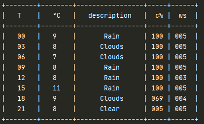

# weather_texter
A script to pull tomorrow's weather and whatsapp it to me every day.

This project pulls weather data for the following day from https://openweathermap.org/ and sends it to a specified phone number

You will need to sign up to https://openweathermap.org/ to get an API key, and a Twilio to get and SID and auth token.

I created a .bat file and used windows scheduler to execute the program every evening and text me the weather for the following day.
Output looks like this:

  

